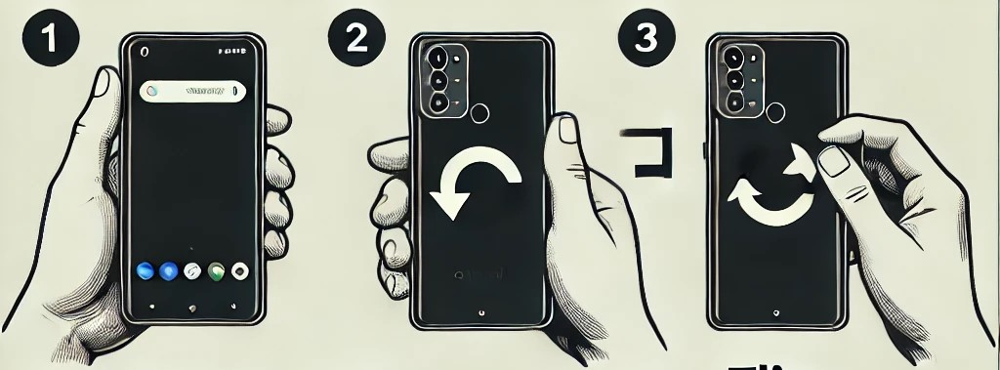

# How to Flip Your Android Phone Upside Down: A Simple Guide

Have you ever needed to flip your Android phone upside down quickly, but weren’t sure exactly how to do it without causing any confusion? Whether you're trying to adjust the phone for a better grip or just want to change its orientation, it’s a pretty simple process once you know how to do it correctly. In this post, we’ll walk you through the steps to flip your phone upside down — starting with the screen facing up, and ending with the phone’s back cameras facing you.

<figure><figcaption>
how to filp the phone
</figcaption></figure>

#### **Step-by-Step Guide to Flipping Your Android Phone**

Follow these easy steps to flip your Android phone upside down:

1. **Start with the Screen Facing Up:**
   * Hold your phone in a natural position with the screen facing up towards you.
   * The screen should be visible, and the front-facing camera should be on top (if your phone has one).
2. **Flip the Phone:**
   * Now, carefully rotate your phone 180 degrees.
   * You should be rotating the phone horizontally, from left to right or right to left, while keeping a firm grip. This will make the screen face down.
3. **Phone Now Upside Down:**
   * After the flip, your phone should be positioned with the back facing you.
   * The phone’s back cameras should now be visible, and the screen is facing the surface (or in this case, the ground) below.
4. **Back to Normal (Optional):**
   * To return your phone to its original position, simply flip it back in the opposite direction, restoring the screen to its original orientation.

#### **Why Flip Your Phone Upside Down?**

There are several reasons you might want to flip your Android phone upside down:

* **Gripping Comfort:** If you’re holding your phone in one hand for extended periods, flipping it upside down can provide better balance and comfort.
* **Camera Orientation:** Flipping your phone can also be helpful for taking pictures or videos, especially when you want to use the rear cameras.
* **Screen Protection:** Sometimes, flipping the phone upside down helps protect the screen from scratches, especially when placing it on a rough surface.
* **Security Measures**: For some applications are using verification methods like this. In MacNa-MC You can experience this kind of situation 🤭

#### **Conclusion**

Flipping your Android phone upside down is an easy and quick action to perform. Whether you’re adjusting it for comfort, taking better pictures, or protecting the screen, this simple move can be quite helpful in daily use.

Now that you know how to flip your Android phone with ease, give it a try! The next time you need to adjust your phone’s orientation, you’ll know just what to do. Happy flipping!
